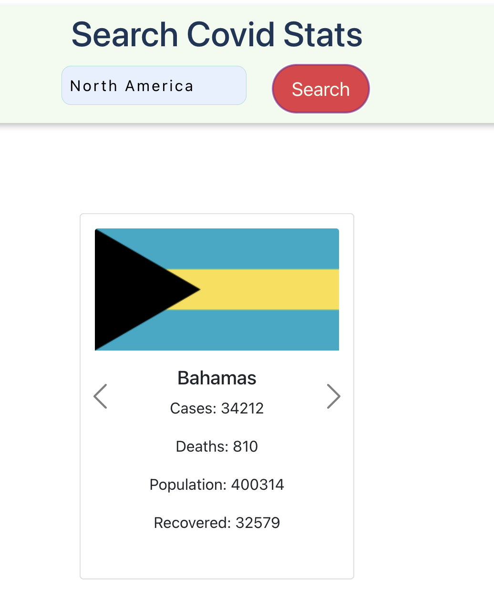

# COVID-19 Heatmap

## Project Description

This is a paired coding project that forms part of the HyperionDev Graduade Program.

The project aims to create a COVID-19 Heatmap web application that allows registered users to view and query COVID-19 data for regions and countries that they are interested in.

## Contents

## High Level Requirements

The high level requirements include:

- User registration and authentication
- User may query COVID-19 data for any reagion/continent/country/ of interest
- Users can download images of heatmaps they query
- Users can subscribe to receive 24 hour email updates on a particular heapmap

* Users can unsubscribe from email updates
* Users can make heatmap queries from the command line
* The public-facing web page only displays heatmaps with new cases and deaths

## Data Sources

A number of COVID-19 data sources were considered to feed into the heamap. The availability of an API to request the data factored highly in the decision of the data source that would be used.

### Global Health - [https://global.health](https://global.health/)

Review of the COVID-19 data maintained on global.health showed that the data is not up to date. This could be lmiting on the functionality that allows users to subscribe for 24 hour email updates.

### Data Rich Services - COVID-19 Data Center - [https://covid19.richdataservices.com/](https://covid19.richdataservices.com/)

The coverage of the data available Rich Data Services is limited to daily data per country on the following:

- confirmed cases
- deaths
- recoveries
- active cases

The international data is sourced from the Johns Hopkins University CCSE Country Reports [https://github.com/CSSEGISandData/COVID-19](https://github.com/CSSEGISandData/COVID-19).

### disease.sh - Open Disease Data API - [https://disease.sh/](https://disease.sh/)

This API allows COVID-19 data requests from the following sources for free:

- Worldometers, updated every 10 minutes
- John Hopkins University, updated every 10 minutes

The Worldometer data includes the following:

- cases,
- deaths,
- country longitude and latitude
- recoveries
- COVID tests

This was the data source that was finally used for the heatmap. The availability of the longitude and latitude per country allowed for the COVID-19 stats to be mapped to the specific country.

## COVID-19 Heatmap app

The COVID-19 Heatmap App was built using a React Front-end and a Django Back-end. Mapbox was used to display the COVID-19 map with the data points showing the stats per country.

### How to run the app

To run the app both the front-end and the back-end servers have to be running.

The application front-end is in the heatmap_frontend folder. In the CLI install the front-end dependencies by running the command `npm install`.
To start the front-end run the command `npm start `. The front-end app will runs on localhost:3000

The backend will require a virtual environment to run. In the root of the project start the virtual environment and then run the command ` python manage.py runserver`

A Mapbox API key will need to be aquired to allow the Mapbox API to be usable. The API key will need to be entered on the home.js and the SubscribedHeatmap.js files in heatmap_frontend/src/components directory.

```
import mapboxgl from "mapbox-gl";

mapboxgl.accessToken = 'xxxxx'

```

Once both servers are running the application allows the user to:

- Register an account 
- Login to the account 
- View the Heatmap 
- Query the COVID-19 data 

## Terminal interface manual for the COVID-19 app.

### How to run the CLI version of the COVID-19 app.

To run the app, you will need Python installed.

To verify if python is installed on your device open the terminal/command prompt/shell on your device.

For Windows:
```
python --version
```
For Linux/iOS:
```
$ python3 --version
```

The result should be the version of Python installed on your device. 
But if you receive different results then that means Python is not installed on your device.

To download and install Python on your device you have to visit [https://python.org](https://python.org) and download the appropriate version of python sutable for your device.

## How to use the COVID-19 CLI application. Upon downloading the Covid_Terminal_Interface.py file.

Open the terminal/command prompt/shell on your device. 
Navigate to where you have stored this application. e.g `C:\Users\Downloads\Terminal_Covid_App`

Once you have navigated to the applications file location enter the following to execute the python script: 
```
python covid_terminal.py
```
`e.g C:\Users\Downloads\Terminal_Covid_App> python covid_terminal.py`

Having followed these steps you should be presented with the applications menu that you can follow.
